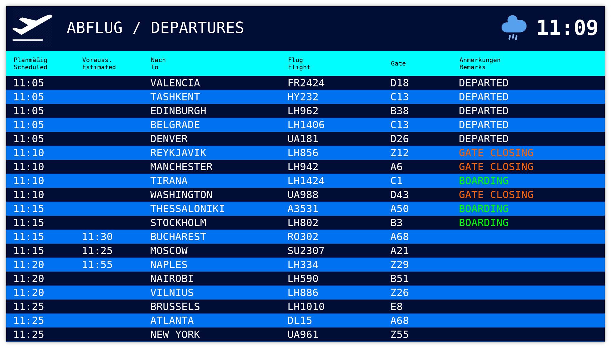

# wmk-fids

This is a mock Flight Information Display System (FIDS) developed as a prop for the musical production "Terminal 2" of the Wiesbadener Musik- und Kunstschule.

I created this because I wanted a nice-looking mock departure board that was easy to use and yet a bit more interactive than a dumb static image file, but all I could find was software intended for actual airports that is way too much overkill and way too expensive for a simple prop.

I'm uploading this now on the off chance that someone else is looking for the same thing.

This is what it looks like:

Note that this was hacked together in about a weekend for the specific purposes of our musical production. It was not really designed to be easily adaptable or extensible, so if you want to change it for your purposes, you might have to dig through some uncommented C++ code.

## FAQ

**How do you build this? What libraries are needed and what platforms are supported?**

It uses CMake as a build system. It was mainly developed and tested on Linux, but it should be fairly cross-platform. It's written in C++ and requires Qt5 as well as [my libnxcommon library](https://github.com/alemariusnexus/nxcommon). For libnxcommon, you can simply clone the full nxcommon repo into wmk-fids's src directory and call the cloned directory "nxcommon". CMake should then pick it up automatically and compile it along with wmk-fids.

**How do I use it?**

Just make sure it finds its data directory (either in the current working directory, or in the executable directory), and run the executable. It will open two windows: The actual display board (press ENTER to make it full-screen), and the control window. The control window can be used to send cues that make the display's appearance change (i.e. suddenly cancelling all flights, switching to a PAUSE screen, or changing the time of day).

**How do I configure it?**

Look at the data/config.js file. You can configure lots of things about the appearance like colors, sizes and the actual text that is displayed. You can also configure the flight plan, the modes that can be entered via button cues, and some parameters about the flight simulation (beware!). If something is not configurable in there, I'm afraid you'll have to dig into the C++ code.

**How does it work?**

It uses the flight plan from config.js and then runs a simple simulation that uses fixed time intervals with some randomness to change between the flight states (BOARDING, GATE CLOSING, DEPARTED, CANCELLED). It also sprinkles in some random delays here and there. It's not very fancy, but it makes it look like flights are actually happening.

## Known Limitations

* Do not ask me what happens when the clock passes midnight. You don't want to know.

## Attributions

The icons in data/icons are from [amCharts](https://www.amcharts.com/free-animated-svg-weather-icons/), released under the Creative Commons Attribution 4.0 International Public License.
